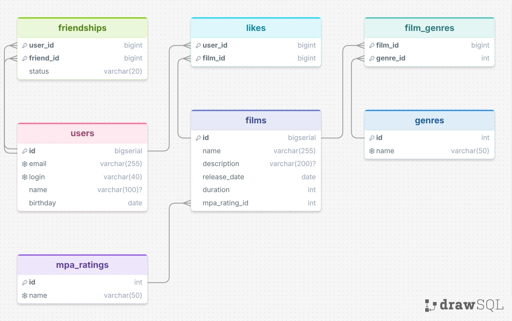

# java-filmorate

Template repository for Filmorate project.



## Схема базы данных

ER‑диаграмма отражает структуру БД для Filmorate с учётом нормализации (1НФ–3НФ).
Жанры, MPA‑рейтинги и связи (лайки, дружба) вынесены в отдельные таблицы, чтобы избежать дублирования и поддерживать бизнес‑логику.

### Примеры запросов для основных операций

**Топ‑5 самых популярных фильмов (по количеству лайков):**
```sql
SELECT f.name, COUNT(l.film_id) AS likes_count
FROM films f
LEFT JOIN likes l ON f.id = l.film_id
GROUP BY f.id, f.name
ORDER BY likes_count DESC
LIMIT 5;
```

**Жанры конкретного фильма (например, фильм с id = 1):**
```sql
SELECT g.name AS genre_name
FROM genres g
JOIN film_genres fg ON g.id = fg.genre_id
WHERE fg.film_id = 1;
```

**Общие друзья двух пользователей (user_id = 1 и user_id = 2):**
```sql
SELECT u.name AS common_friend_name
FROM friendships f1
JOIN friendships f2 ON f1.friend_id = f2.friend_id
JOIN users u ON f1.friend_id = u.id
WHERE f1.user_id = 1 AND f1.status = 'CONFIRMED'
  AND f2.user_id = 2 AND f2.status = 'CONFIRMED';
```

## Основные сущности

- `films` — фильмы (название, описание, дата релиза, длительность, рейтинг MPA).
- `users` — пользователи (имя, логин, почта, дата рождения).
- `likes` — лайки: связь фильма и пользователя (кто и какой фильм оценил).
- `genres` + `film_genres` — жанры: один фильм может иметь несколько жанров.
- `friendships` — дружба между пользователями со статусами: UNCONFIRMED (заявка), CONFIRMED (подтверждено).

## Запуск проекта

1. Собери проект: `mvn clean package`.
2. Запусти зависимости через Docker Compose: `docker compose up -d`.
3. Запусти приложение: `mvn spring-boot:run`.
4. Приложение доступно по адресу: `http://localhost:8080`.
